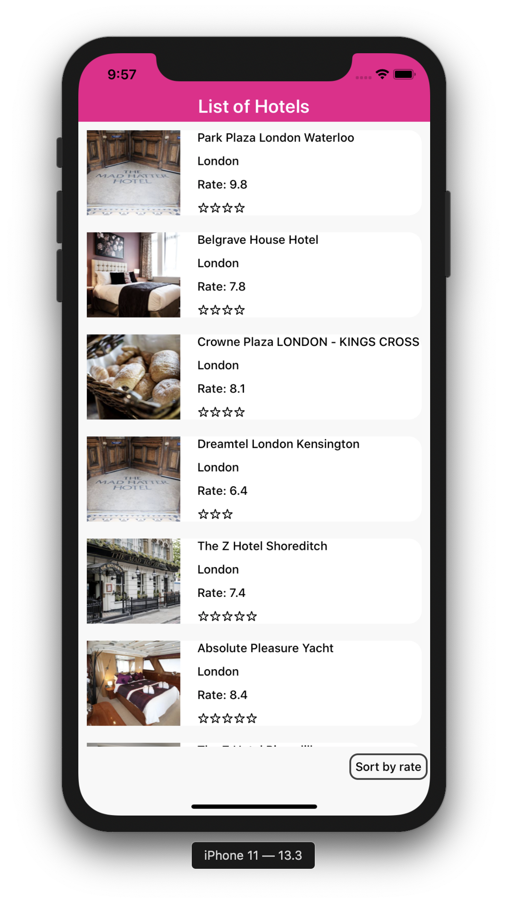

# List of Hotels app

In the project directory, you can run:

### `yarn ios` `yarn android`

To run it on simulator/emulator

### `yarn test`

To run all the tests

## Description

Project was bootstrapped with React Native CLI.

App is written in React Native mostly in TDD approach, project is well structured. There is a list of hotels with proper tested components, we have custom hook and some helpers functions. UI is based on LastMinute.com colors.
